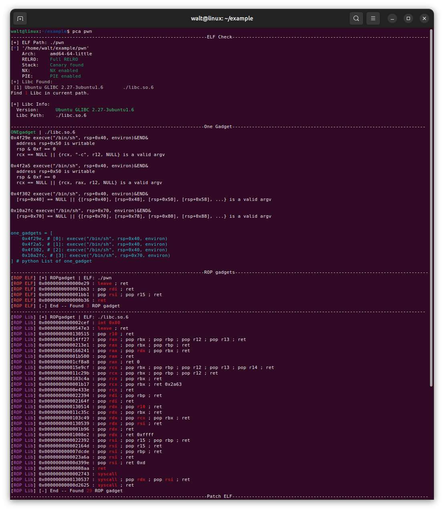
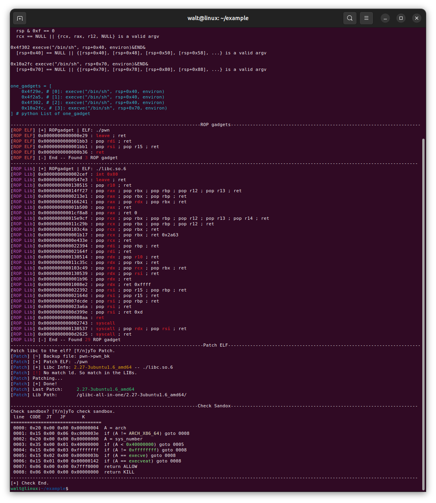
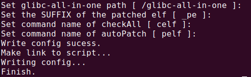
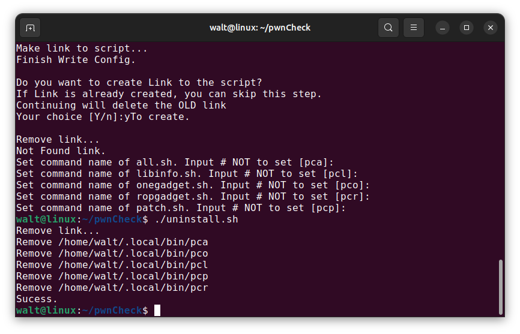
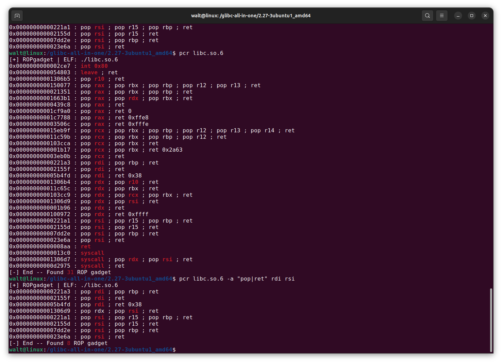
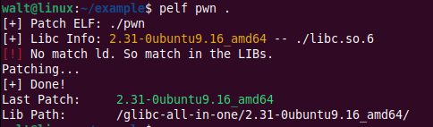
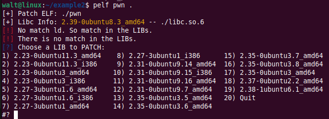
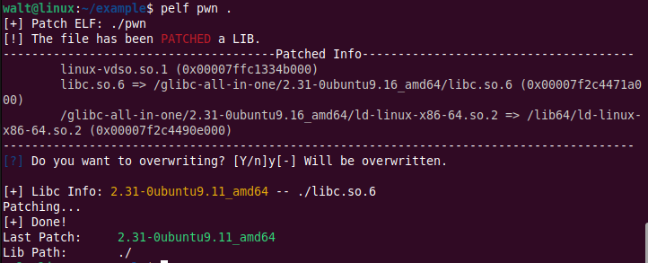

# pwnCheck

## 简介

集成了CTF竞赛**PWN**方向**用户态**题的大部分准备工作。主要适配x86架构ubuntu系统环境，其他环境适配性未测试，取决于引用工具的适配性。

包括如下内容：

1. 检查ELF文件保护机制
2. 自动确定libc版本
3. 获取libc文件的one_gadget
4. 获取ELF文件和libc文件中的常用ROP gadget
5. 修改ELF的动态链接器
6. ELF文件沙盒检测

上述工作大部分命令过于繁琐，因此将其集成在脚本中，实现自动化准备工作。





## 安装

需要已安装`pwntools`，`seccomp-tools`，`patchelf`，`ROPgadget`等pwn工具。

拉取git仓库后运行`install.sh`。

```bash
git clone https://github.com/waltchans/pwnCheck.git
cd pwnCheck
./install.sh
# 按下面说明配置。懒人选项：设置好glibc-all-in-one后一路回车。
```

在安装过程中，请根据提示进行设置。回车表示采取`[ ]`内的默认值。有如下选项：

- glibc-all-in-one路径：输入glibc-all-in-one中**libs**文件夹路径。用于patch文件时获取lib列表。
- ELF文件备份格式：执行patch时，将以该文件名格式备份源文件，`'$'`指代源文件名。
- ELF文件patch格式：执行patch时，将以该文件名格式输出patch后文件，`'$'`指代源文件名。
- 全部检测时默认参数：在**不带参数**执行全部检查脚本(`all.sh`)时，所执行的默认参数，参考下文。
- 是否创建链接：将在`$PATH`环境变量其中一个路径下**创建**指向各脚本的**链接**。对每个脚本的链接名设置中，输入`#`表示**不创建**。优先选取位于用户文件夹下的`$PATH`路径(`/home/$USER/.local/bin`)，若用户文件夹下无路径，则选取系统`$PATH`路径（如`/usr/bin`），此时需`sudo`权限。



### TIPs

`glibc-all-in-one`请根据自身实际情况设置。其他选项可以

备份格式和patch格式使用方式如下：当设置备份格式为`origin_$_bk`，patch格式为`$_pe`。当对ELF文件`pwn01`执行patch脚本后(`patch.sh pwn01`)，会将`pwn01`原文件备份为`origin_pwn01_bk`，patch过的文件名为`pwn01_pe`。建议有且仅有其中一项设为`$`。以下组合可供参考：

| 备份格式 backup format | 修补格式 patch format | 备注                                           |
| ---------------------- | --------------------- | ---------------------------------------------- |
| `$_bk`                 | `$`                   | 原文件名为修改后文件                           |
| `$`                    | `$_pe`                | 不修改源文件                                   |
| `$`                    | `$`                   | 直接在源文件上修改（patch操作不可逆）          |
| `origin`               | `patched`             | 无论原文件名为何，均修改为统一文件名（不推荐） |
| `$_$_$`                | `$-$-$`               | `$`可含多个，均可生效                          |

创建链接可根据实际创建，可自定义链接名，即命令名称。假如设置`all.sh`的链接名为`pwncheckall`，则可执行`pwncheckall`命令即为调用`all.sh`脚本。默认链接名以精简为主，方便记忆和调用。例如，`pca`为`pwn check all`的缩写，`pcr`为`pwn check ropgadget`缩写，其他默认名称类似。

### 卸载

`install.sh`仅在`$PATH`路径创建链接，以及在仓库根目录下创建配置文件。如需卸载，可执行`uninstall.sh`后，自行移除仓库文件。

```bash
cd pwnCheck
./uninstall.sh
cd ..
rm -rf pwnCheck
```

`uninstall.sh`将会删除全部`$PATH`路径下指向当前目录及子目录下文件的链接。



## 使用

使用安装时设定的链接名调用。使用`-h`或`--help`可输出对应脚本的使用说明。

### all

Check elf all in one! 集成全部检测选项（包含其他检查脚本），默认命令名为`pca`  (pwn check all)。

```bash
pca [OPTION] <ELF> [lib]
```

会同时执行其他脚本，执行哪些脚本取决于传入的选项。当未指定选项时，会读取配置文件获取默认参数（即安装时设定的**全部检测时默认参数**）。

#### 参数

- elf: ELF文件路径。
- lib: 可选，libc文件路径。若未指定，则自动搜索当前目录下的全部libc文件。

#### 选项

- `-h`, ` --help`: 显示帮助。
- `-a`, `--all`: 执行全部检测。
- `-c`, `--sec`: 执行ELF保护检测。`checksec --file ELF`
- `-l`, `--lib`: 寻找libc。`执行libinfo脚本`。
- `-o`, `--one`: 查找one_gadget，当未指定`-l`时此项失效。`执行onegadget脚本`
- `r`, `--rop`: 查找ROPgadget。会查找可执行文件。当指定`-l`时，同时查找libc文件。`执行ropgadget脚本`
- `-p`, `--patch`: patch可执行文件。`执行patch脚本`
- `-s`, `--seccomp`: 检测可执行文件的沙盒保护。`seccomp dump ELF`

#### 示例

```bash
pca pwn				# 执行默认检测
pca pwn -a			# 执行全部检测
pca pwn -clorps		# 执行全部检测
pca pwn -lo			# 仅查找one_gadget
pca pwn libc.so.6 	# 指定libc
pca pwn -lcs		# 仅扫描lib，检查可执行文件保护和沙盒
```

#### 功能

##### 默认参数

在配置文件中指明了该脚本默认运行参数。

若配置文件指明默认运行参数为`-lor`。则当执行`pca pwn`时，仅会执行三项内容：扫描lib、查询libc的one_gadget，查询可执行文件和libc的ROPgadget。

### libinfo

在指定目录搜索libc文件并输出libc版本信息。默认命令名为`pcl` (pwn check lib)。

```bash
pcl [ELF|path]
```

#### 参数

- [ELF|path] : libc文件或目录。
  - 参数为libc文件，则会输出该libc文件版本信息。
  - 参数为目录，则寻找当前目录下所有libc文件，并输出其版本信息。
  - 参数留空，则使用默认参数`.`，在**当前目录搜索**所有libc文件。

#### 示例

```bash
pcl
pcl .
pcl ./libc.so.6
pcl ./lib
```


### onegadget

查找指定ELF（主要为`libc.so`）的one_gadget，并将one_gadget地址整理为**python列表**。默认命令名为`pco`(pwn check one_gadget)。

```bash
pco elf [OPTION] ELF
```

#### 参数

- ELF: 需要寻找one_gadget的ELf文件。一般为`libc.so`文件。

#### 选项

- `-h`, `--help`: 显示帮助。
- `-p`, `--pydump`: Python列表格式one_gadget输出。默认参数。
- `-o`, `--origin`: 原生`one_gadget`命令输出，与`one_gadget`完全等价。
- `-a`, `--all`: 两者均输出。等价同时使用`-o`和`-p`，在输出原生命令输出后，输出python列表格式输出。

#### 示例

```bash
pco libc.so.6
pco -p libc.so.6
pco -o libc.so.6	# 等价one_gadget libc.so.6
pco -a libc.so.6
```

### ropgadget

寻找指定文件的`ROPgadget`。 默认命令名为`pcr` (pwn check ropgadget)。

```bash
pcr [OPTION] ELF [reg]...
```

为`ROPgadget`命令的简单封装。最简命令为`pcr ELF`，可以输出最常用的`ROPgadget`，包括`pop`、`syscall`汇编命令，且以常见传参寄存器过滤。

封装格式如下，以下命令等价：

```bash
pcr pwn -a "pop|ret" rdi rsi
ROPgadget --multibr --binary "pwn" --only "pop|ret" | grep -E "rdi|rsi"
```

#### 参数

- ELF: 需要寻找ROPgadget的ELf文件。可以是可执行文件或者libc.so文件。
- [reg]... : 过滤寄存器，可输入多个。过滤条件为**逻辑或**。本质为将每一项均作为`grep`命令参数。

#### 选项

- `-h`, `--help`:  显示帮助。
- `-a`,`--asm`: 指定汇编指令。即`ROPgadget`的`--only`选项内容。

当`-a`未指定时，使用默认参数`syscall|pop|ret`。当`[reg]`未指定时，使用默认参数（常见32位和64位寄存器）。

#### 示例

```bash
pcr ./pwn
pcr ./pwn rdi rsi
pcr -a 'lea|ret' ./pwn					# -a选项可以放在ELF前面
pcr ./pwn -a 'mov|ret'
pcr ./pwn -a 'pop|ret' rdi rsi 
```



### patch

Auto patch elf. 自动修改ELF的动态链接器。默认命令名称为`pcp`(pwn check patch) 。

```bash
pcp <ELF> [lib|path|ver]
```

#### 参数

- `ELF`: 需patch的**可执行文件**路径。
- `[lib|path|ver]`: 可选，可指定`版本号`、`libc路径`或`libc所在目录`。

#### 选项

- `-h`,`--help`: 显示帮助。
- `-o`,`--output`: 输出文件名。指定patch后输出文件名称。

#### 示例

```bash
pcp pwn libc.so.6
pcp pwn libc/
pcp pwn 2.35
```

#### 功能

##### lib智能选择

不同选项会遵循如下逻辑：

| lib内容             | 功能                                                         | 示例   |
| ------------------- | ------------------------------------------------------------ | ------ |
| lib路径/lib所在目录 | 判断该lib版本。若存在ld文件，则以该文件/文件夹为patch路径。否则在glibc-all-in-one中查找相同版本的lib。 | `./`   |
| 版本号              | 在glibc-all-in-one中查找名称匹配的可选项。                   | `2.35` |
| 空                  | 列出glibc-all-in-one中全部可选项。                           |        |

指定lib路径，无ld则自动匹配glibc-all-in-one：



指定版本，仅显示匹配项:


若指定lib选项时无法匹配版本，则会提供全部选项以供选择。



##### 覆盖提示

若文件已存在patched版本，则显示已patched文件链接信息，并询问是否覆盖：



